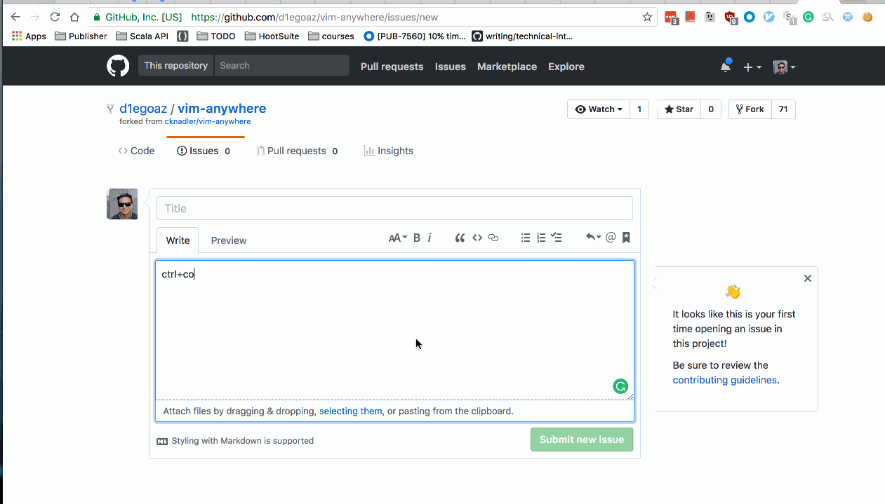

# Emacs-anywhere


See upstream readme in https://github.com/cknadler/vim-anywhere/blob/master/README.md


## My fork differences

- It's using `/usr/local/bin/emacsclient -c` on OSX
- Copies to clipboard current selected text (if any), if there are not selected text it clears up the clipboard
- Paste new edited text back into the original application



### Install

```
curl -fsSL https://raw.github.com/d1egoaz/kakoune-anywhere/master/install | bash
```

* OSX caveat:* key binding is unbound by default. See keybinding for details.

Update
```
~/.kakoune-anywhere/update
```

Uninstall
```
~/.kakoune-anywhere/uninstall
```
